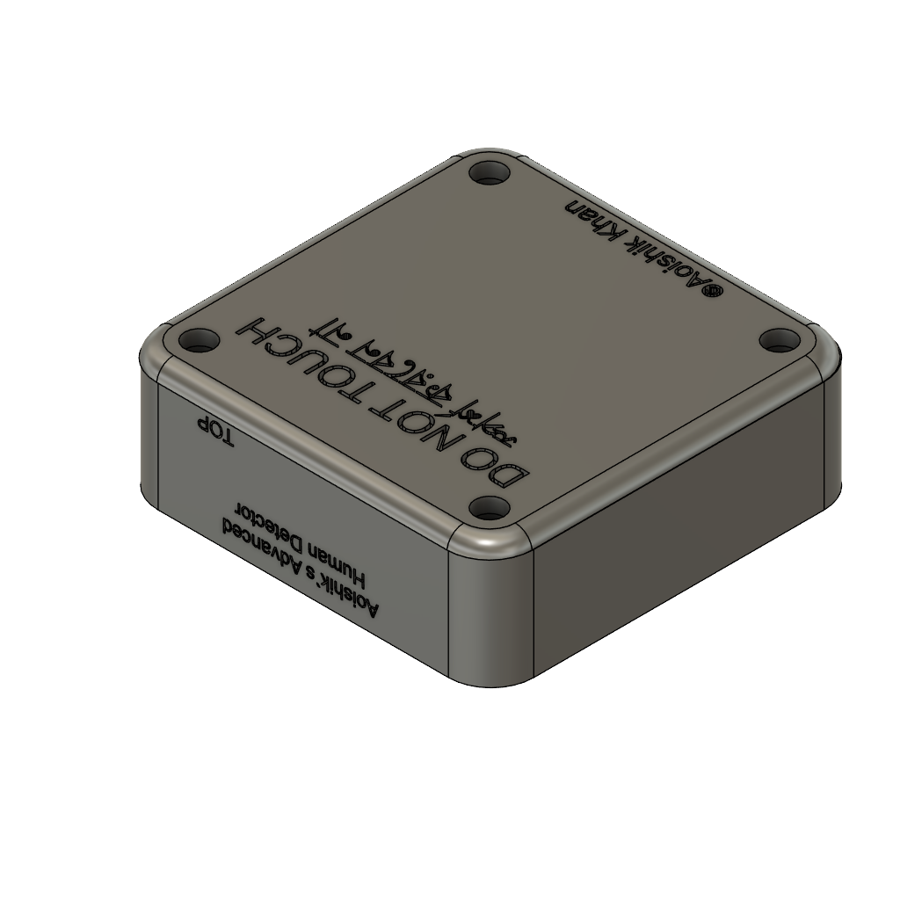
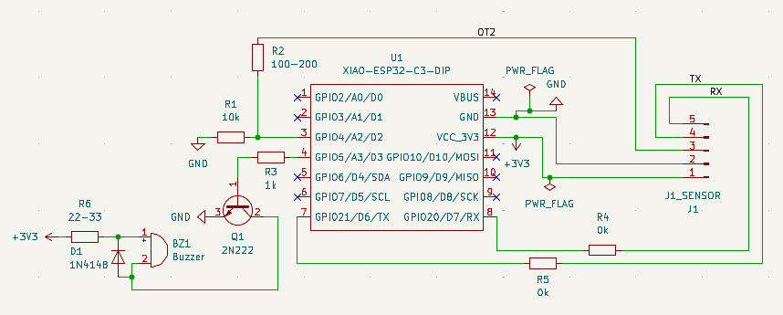
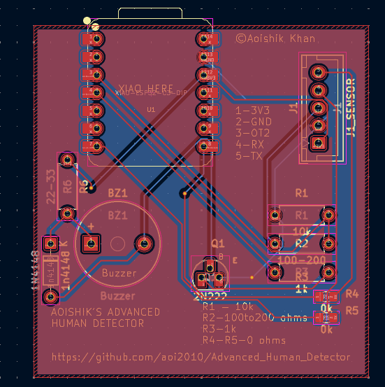
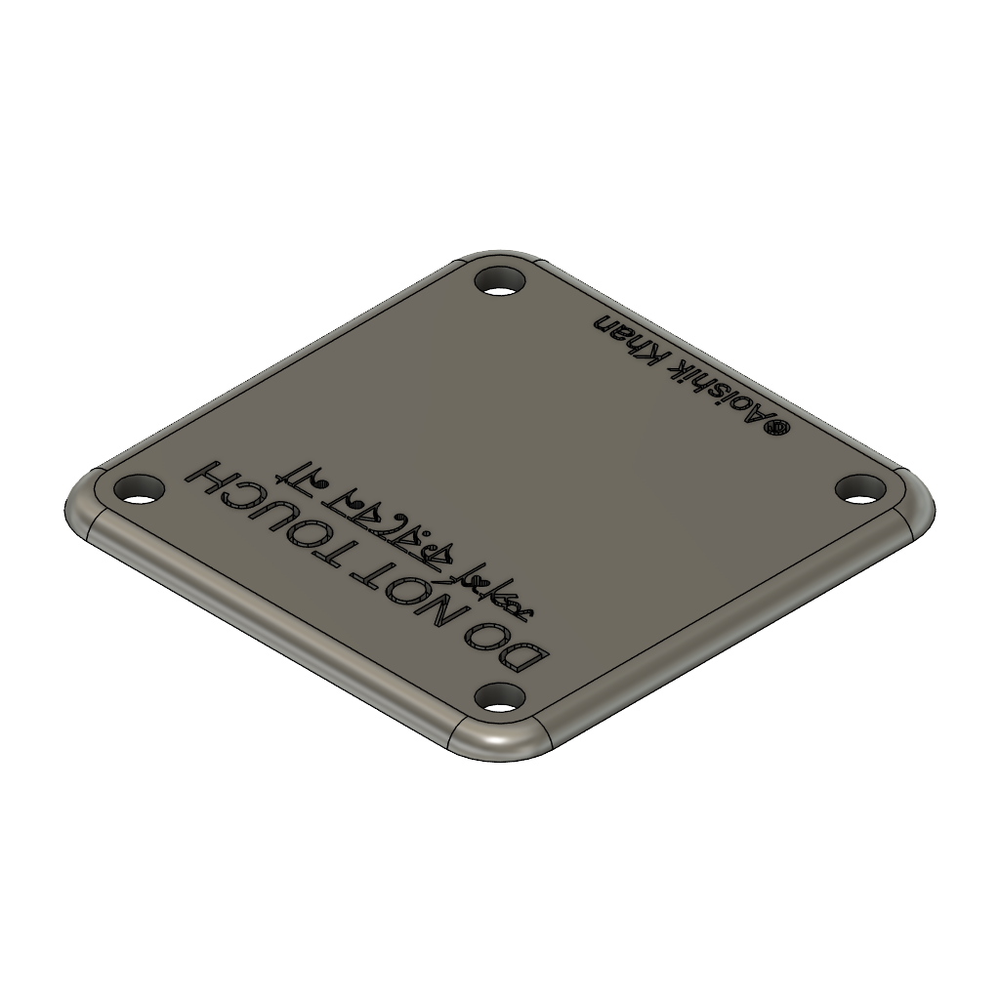
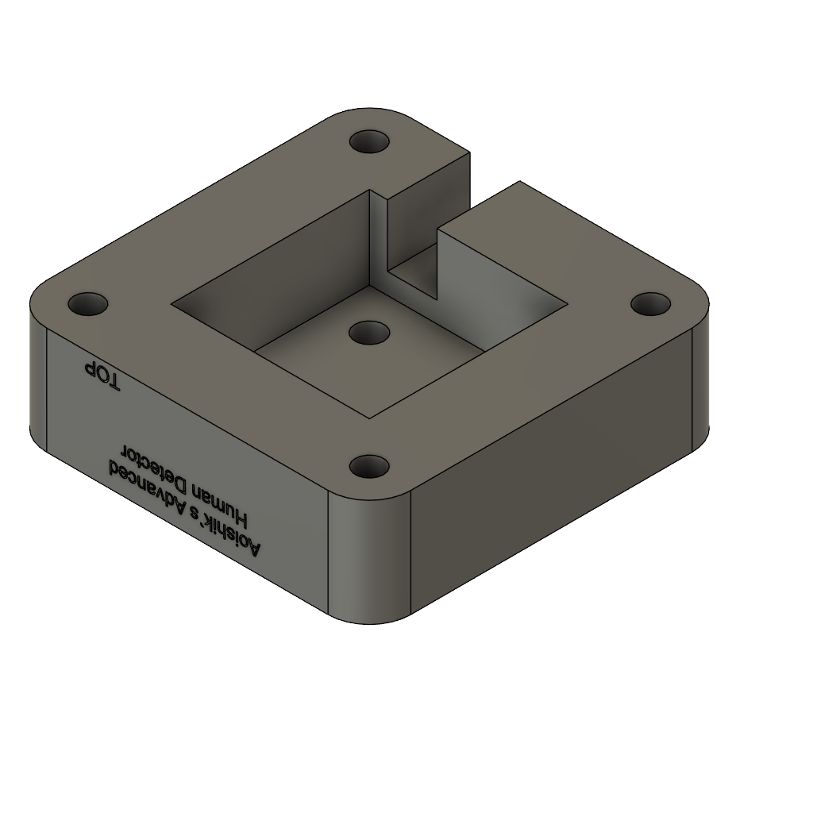

# Advanced Human Detector
This is a human detector which uses HmmD Mmwave Sensor to detect humans.

### Inspiration

I wanted to create a human detector using the Mmwave Sensor to detect humans and alert me when human is detected cuz some people always steals the flowers in my garden, and I want to catch them in the act.

### Challenges

Believe it or not, this was my second time using Fusion 360 and KiCad! I watched numerous tutorials and guides and did a kg of googling, but in the end, I'm pretty proud of the final product. I had the most struggle figuring out how to make sketches, and with the new mouse controls, it definitely took me a while to get the hang of it. Also in KiCad, I had a lot of trouble with footprints and making sure everything was aligned properly and the traces were correct(but it became a litle long traces).

### Specifications

BOM: 
- 1x [Seeed Studio XIAO ESP32-C3 development board](https://robu.in/product/seeed-studio-xiao-esp32c3-tiny-mcu-board-with-wi-fi-and-ble-battery-charge-supported-power-efficiency-and-rich-interface/)
- 1x [Waveshare HMMD 24 GHz mmWave human presence sensor](https://robu.in/product/waveshare-human-micro-motion-detection-mmwave-sensor-24ghz-mmwave-radar-based-on-s3km1110-adopts-fmcw-technology/)
- 1x [Passive piezo buzzer, 3 V, Ø12 mm](https://robu.in/product/hc12075c-16-cldz-electromagnetic-passive-integrated-buzzer-1-5-3v12x7-5mmimpedance16%CF%89lateralpronunciation/)
- 1x [NPN transistor 2N2222, TO-92 package](https://robu.in/product/2n2222-npn-transistor-pack-of-20/)
- 1x [Resistor 10 kΩ, ¼ W, through-hole](https://robu.in/product/mfr-25frf52-10k-yageo-metal-film-resistors-10k%CF%89-250mw-%C2%B1100ppm-%E2%84%83-%C2%B11-plugind2-4xl6-3mm-through-hole-resistors-rohs/)
- 1x [Resistor 1 kΩ, ¼ W, through-hole](https://robu.in/product/1k-ohm-0-25w-metal-film-resistor-pack-of-100/)
- 1x [Resistor 100–200 Ω, ¼ W, through-hole](https://robu.in/product/0-25w-100-ohm-resistor-pack-of-100/)
- 1x [Resistor 22–33 Ω, through-hole](https://robu.in/product/mf25-33r-multicomp-pro-through-hole-resistor-33-ohm-mf25-series-250-mw-%C2%B1-1-axial-leaded-250-v)
- 1x [Signal diode 1N4148](https://robu.in/product/1n4148-onsemi-100v-1v10ma-4ns-200ma-do-35-switching-diodes-rohs/)
- 2x [0 Ω SMD resistor](https://robu.in/product/1-month-warranty-149/)
- 1x [5-pin connector / header for HMMD sensor - Male](https://robu.in/product/xh-a-2-5mm-5-pin-wafer-male-connector-through-hole-straight/)
- 1x [5-pin connector / header for HMMD sensor - Female](https://robu.in/product/xh-a-aw-2-5mm-5-pin-female-housing-connector-with-300mm-wire28-awg/)
- 1x [LAN / multi-core cable for sensor connection](https://www.amazon.in/Electronic-Spices-Ethernet-Patch-Network/dp/B0D4HYL67Z)
- 4x [M3x16mm Screws](https://onlyscrews.in/products/copy-of-chhd-m3-x-20mm-pack-of-21?variant=48458789257529)
- 4x [M3x4mm Heatset Inserts](https://onlyscrews.in/products/m4-x-4mm-brass-threaded-inserts?variant=49091565650233)
- 1x [PCB](https://www.lioncircuits.com/) 

Others:
- Micropython Firmware
- PCB Gerber File(PCB/motionalr_mcu.zip)
- Top and Bottom of Sensor Case STL files for 3d Printing
- BOM.csv

Schematic            |  PCB         |   Sensor Case (Top)   |   Sensor Case (Bottom)
:-------------------------:|:-------------------------:|:-------------------------:|:-------------------------:|
    |    |  | 

### Notes
The code is still basic in functionality because of lack of information on the sensor datasheet, but I will update it as soon as I get the sensor and debug it's output. The case for the mmwave sensor is measured with approx measurement available online, so I will also update the case design once I get the sensor and measure it myself. The PCB will be left bare as I like looking at PCBs.

## Thanks For Reading! Also leave a star if you like the project! ⭐

